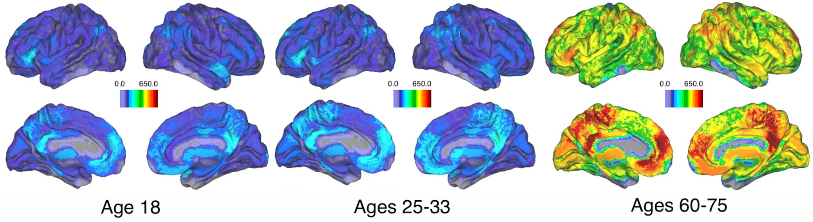
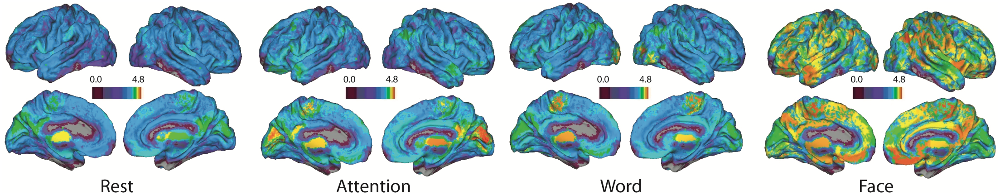
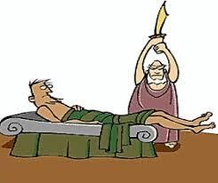

# Robust-Shared-Response-Model

# Introduction 

In the beginning of our fall semester of grad-school, we began working on a Brain Computer Interface Capstone project for the Department of Psychology at the University of Virginia. Brain Computer Interfaces (BCI) use electroencephalography (EEG) data collected from the human brain to predict behavior. This technology will soon be capable of enhancing prosthetic technologies, and perhaps in the far off future lead to even more astonishing and strange human advancements such as artificial memory storage. 

There are, however, many hurdles to successfully implementing a model that predicts human behavior. Since these models interact directly with humans, the stakes of failure are extremely high. If a prosthetic foot malfunctions while driving a car, lives could be lost. Furthermore, these models often take a very long time to train. Brain signal topographies look different for different people when performing the exact same actions. In addition, brains often respond to the same event at different time intervals. 

The above image shows the topography of two different brains responding to the exact same event at the same time. However, the topographies look quite different to the human eye. Because of these differences, current models are usually trained with no prior knowledge. This leads to extensively long train times which are both expensive and not very practical for real world scenarios. We propose that a model initially built for fMRI modeling called the Shared Response Model can be applied to EEG modeling. The idea behind the Shared Response Model is to extract components that are shared across subjects in order to pre-train a model before it is even used on an individual subject. The initial findings from the fMRI model found that using a shared response model both increased the accuracy and reduced the train time of models built for specific people. Naturally, we did not find it to be a far-fetched idea to try to implement this model with a different, albeit, similar type of data. 

Recently, a newer version of the shared response model was implemented called the “Robust Shared Response Model”. This model incorporates a new variable that represents what is unique to each individual. In other words, the robust shared response model is capable of distinguishing between what is shared by all participants and what is unique to each participant. The team who implemented the new model found that “RSRM was able to improve the accuracy more than 60% over SRM for the coding of infant fMRI data.” This algorithm includes lots of fun tricks such as solving the Orthogonal Procrustes problem which is named after the mischievous son of Poseidon who wrangles and delimbs his victims so they can fit into his bed.  

This github repository will go into detail about how the robust shared response model is working by implementing the code in R. This post will not include using EEG for the RSRM. That, after all, is for our next semester in grad school. We did, however, find the RSRM algorithm to be quite beautiful so we wanted to share how it works with the student teacher community. Many readers may find that the algorithm is multifunctional and can be used across domains. In the end we will show how the RSRM is capable of extracting components from multiple subjects with a couple shared sine-waves, with noise added for realism.

To see our full blog post, look here: [RSRM Overview](file:///Users/gabrielyohe/DataScience/Fall/Mining/final_project/images/final_project--4-.html)
